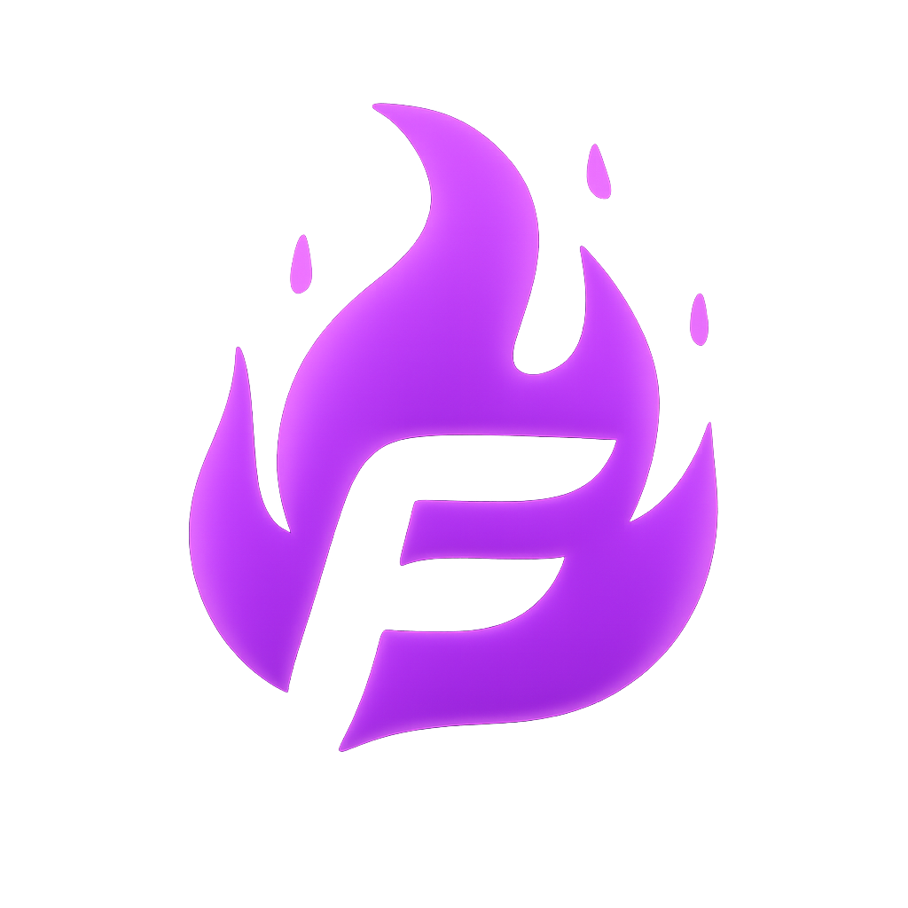
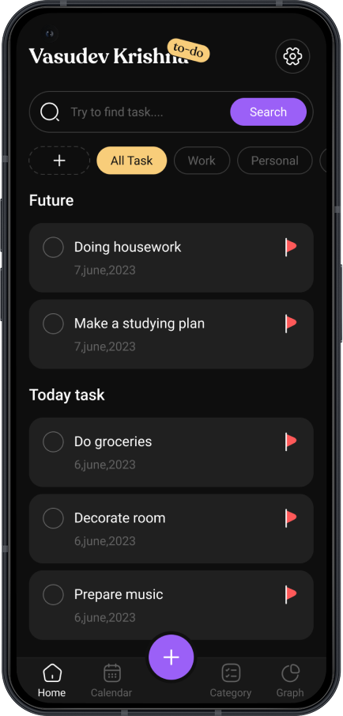
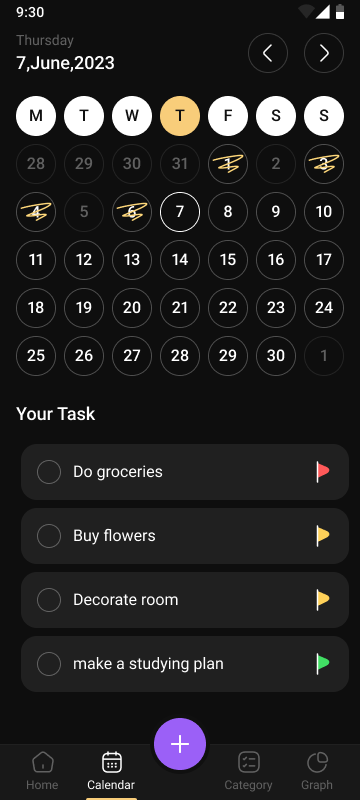
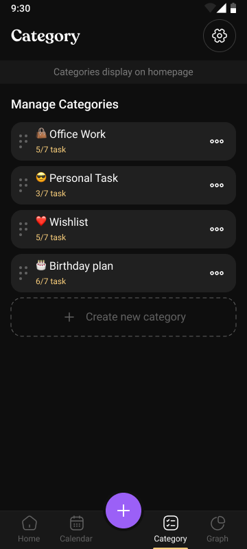
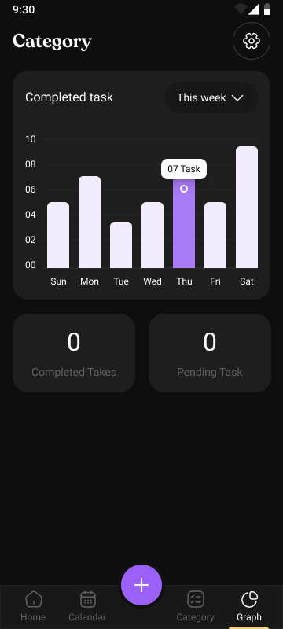
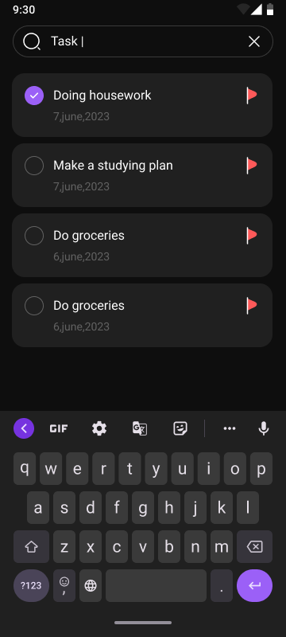
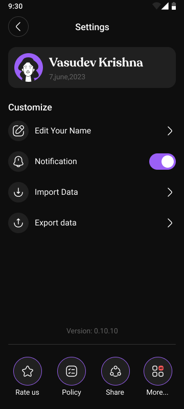
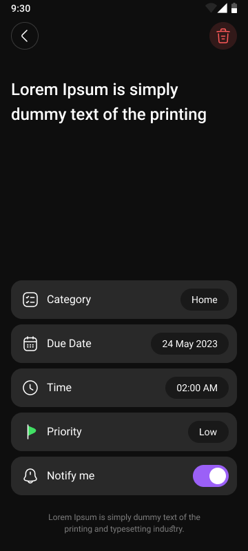

<div align="center">



# 🔥 Fire Todo

**A sleek, feature-rich task management app built with Flutter**

[](https://flutter.dev)
[](https://dart.dev)
[](https://bloclibrary.dev)
[](https://isar.dev)
[](https://www.figma.com/design/GGbCazeecJ3T1FqRxox0CV/%F0%9F%93%83Easy-To_do--create-by-workline-?node-id=1-7929&p=f&t=JRzKdQfxInkmmkU8-0)
[](LICENSE)

</div>

---

## ✨ Features

- 📋 **Task Management** — Create, edit, delete and reorder tasks with drag & drop
- 🗂️ **Categories** — Organize tasks by custom categories
- 📅 **Calendar View** — Visual calendar with task highlights per date
- 📊 **Graph Analytics** — Weekly, monthly and yearly task completion charts
- 🔍 **Search** — Instantly search across all tasks
- 🔔 **Notifications** — Task reminder notifications
- 🌍 **Localization** — Multi-language support (Uzbek, Russian, English)
- 📤 **Export / Import** — Backup and restore your tasks via JSON
- 🌙 **Dark Theme** — Beautiful dark-mode-first design
- 💥 **Smooth Splash** — Elastic zoom-in animated splash screen

---

## 🏗️ Architecture

Fire Todo follows **Clean Architecture** with strict separation of concerns:

```
lib/
├── core/
│   ├── constants/       # AppColors, AppStrings, AppAssets, AppFonts
│   ├── injection/       # GetIt dependency injection
│   ├── provider/        # Global BLoC providers
│   ├── router/          # GoRouter declarative routing
│   └── theme/           # App theme
│
├── features/
│   ├── home/            # Task list, categories, search
│   ├── calendar/        # Calendar view with task dates
│   ├── graph/           # Analytics & charts
│   ├── category/        # Category management
│   ├── settings/        # User settings, export/import
│   ├── search/          # Global task search
│   ├── task_info/       # Task detail screen
│   ├── entrance/        # Onboarding / name entry
│   └── main/            # Navigation scaffold & splash
│
└── shared/
    ├── dialogs/         # Reusable dialogs
    ├── global/          # Shared entities & repositories
    └── widgets/         # Reusable UI components
```

### Layer Structure (per feature)

```
feature/
├── data/
│   ├── datasource/      # Isar local database operations
│   └── repository/      # Repository implementations
├── domain/
│   ├── entity/          # Pure business models
│   ├── repository/      # Abstract repository contracts
│   └── usecase/         # Single-responsibility use cases
└── presentation/
    ├── bloc/ or cubit/  # State management
    ├── screens/         # Screen widgets + Mixins
    └── widgets/         # Feature-specific widgets
```

---

## 🛠️ Tech Stack

| Layer | Technology |
|---|---|
| **Framework** | Flutter 3.x / Dart 3.x |
| **State Management** | BLoC & Cubit (`flutter_bloc`) |
| **Local Database** | Isar (NoSQL, ultra-fast) |
| **Navigation** | GoRouter (declarative routing) |
| **DI Container** | GetIt |
| **Localization** | Easy Localization |
| **Charts** | fl_chart |
| **Functional Programming** | dartz (`Either`, `Option`) |
| **Fonts** | Roboto + Recoleta |
| **Animations** | Native Flutter `AnimationController` |

---

## 🧱 UI Architecture Rules

- Every screen uses **Dart Mixins** to separate event handlers and helper methods from the build tree
- **BLoC/Cubit** for all screen-level state — `setState` only in leaf-level widgets
- **No hardcoded strings** — all text goes through `AppStrings` + `tr()`
- **No ad-hoc colors** — only tokens from `AppColors`
- **Reusable component registry** for dialogs, buttons, cards

---

## 📦 Getting Started

### Prerequisites

- Flutter SDK `>=3.8.0`
- Dart SDK `>=3.0.0`

### Setup

```bash
# 1. Clone the repository
git clone https://github.com/your-username/fire_todo.git
cd fire_todo

# 2. Install dependencies
flutter pub get

# 3. Generate Isar database adapters
dart run build_runner build --delete-conflicting-outputs

# 4. Run the app
flutter run
```

### Generate launcher icons & splash screen

```bash
dart run flutter_launcher_icons
dart run flutter_native_splash:create
```

---

## 🌍 Localization

Supported languages:

| Language | Code | Status |
|---|---|---|
| O'zbek | `uz` | ✅ Default |
| Русский | `ru` | ✅ |
| English | `en` | ✅ |

Translation files are located in `assets/i18n/`.

---

## 📁 Reusable Components

| Component | Description |
|---|---|
| `GlobalText` | Localized text with custom font & style |
| `GlobalImage` | SVG + asset image unified widget |
| `AppButton` | Primary styled button |
| `TaskItemCard` | Swipeable task card with checkbox |
| `SearchTextfield` | Styled search input |
| `TaskNotAvailableWidget` | Empty state placeholder |
| `ToDoBadge` | "TO-DO" badge next to username |
| `showAddTaskDialog` | Add task bottom sheet |
| `showAddCategoryDialog` | Add category dialog |
| `DeleteConfirmationDialog` | Confirm before delete |

---

## 📸 Screenshots

<table>
  <tr>
    <td align="center"></td>
    <td align="center"></td>
    <td align="center"></td>
  </tr>
  <tr>
    <td align="center"></td>
    <td align="center"></td>
    <td align="center"></td>
  </tr>
  <tr>
    <td align="center"></td>
  </tr>
</table>

---

## 🤝 Contributing

Pull requests are welcome. For major changes, please open an issue first to discuss what you would like to change.

---

## 📄 License

This project is licensed under the [MIT License](LICENSE).

---

<div align="center">

Made with ❤️ and 🔥 using Flutter

</div>
